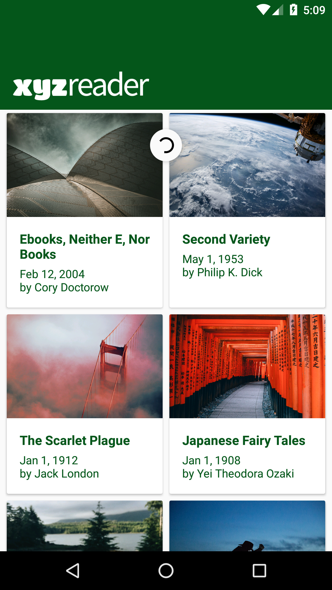
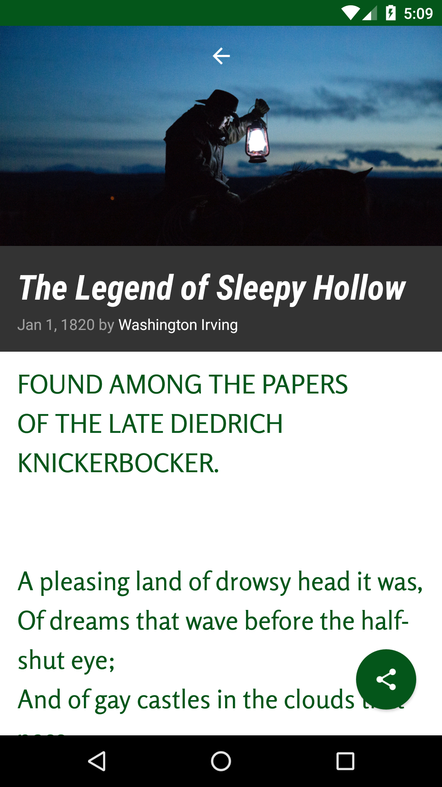

# Make Your App Material

This is the 6th project for the Android Nanodegree with Udacity

# Project Overview
In this project, you will redesign an app to follow the Material Design guidelines and translate a set of static design mocks to a living and breathing app.

# Screeshots

     

# Why this Project?
This project gives you an opportunity to improve an app’s design, a vital skill for building apps users will love. It also replicates a common developer task of updating and changing an app's design as new standards are released.

# What Will I Learn?
Through this project, you will:

- Understand the fundamentals of Android design.
- Apply Material Design guidelines to an mobile application.
- Separate an interface into surfaces.
- Effectively use transitions and motion.

# Helpful Resources:
- https://stackoverflow.com/questions/34173545/missing-support-for-firebase-app-indexing-android-lint
- https://stackoverflow.com/questions/20790708/element-must-be-declared-error-for-tag-shape
- https://www.androidauthority.com/using-coordinatorlayout-android-apps-703720/
